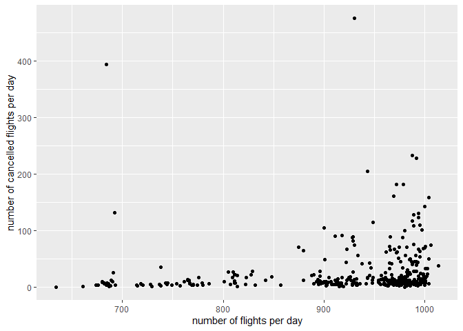
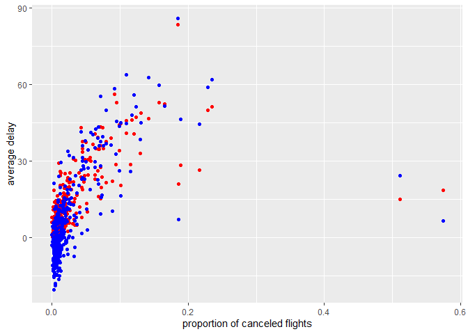

Stat433_HW01
================
2022-09-27

    ## 
    ## Attaching package: 'dplyr'

    ## The following objects are masked from 'package:stats':
    ## 
    ##     filter, lag

    ## The following objects are masked from 'package:base':
    ## 
    ##     intersect, setdiff, setequal, union

    ## Warning: package 'nycflights13' was built under R version 4.1.3

    ## -- Attaching packages --------------------------------------- tidyverse 1.3.1 --

    ## v tibble  3.1.6     v purrr   0.3.4
    ## v tidyr   1.1.4     v stringr 1.4.0
    ## v readr   2.1.0     v forcats 0.5.1

    ## -- Conflicts ------------------------------------------ tidyverse_conflicts() --
    ## x dplyr::filter() masks stats::filter()
    ## x dplyr::lag()    masks stats::lag()

    ## 
    ## Attaching package: 'lubridate'

    ## The following objects are masked from 'package:base':
    ## 
    ##     date, intersect, setdiff, union

## 1. How many flights have a missing dep_time? What other variables are missing? What might these rows represent?

``` r
# 1a. How many flights have a missing dep_time?
sum(is.na(flights$dep_time))
```

    ## [1] 8255

``` r
# 1b. What other variables are missing?
summary(flights)
```

    ##       year          month             day           dep_time    sched_dep_time
    ##  Min.   :2013   Min.   : 1.000   Min.   : 1.00   Min.   :   1   Min.   : 106  
    ##  1st Qu.:2013   1st Qu.: 4.000   1st Qu.: 8.00   1st Qu.: 907   1st Qu.: 906  
    ##  Median :2013   Median : 7.000   Median :16.00   Median :1401   Median :1359  
    ##  Mean   :2013   Mean   : 6.549   Mean   :15.71   Mean   :1349   Mean   :1344  
    ##  3rd Qu.:2013   3rd Qu.:10.000   3rd Qu.:23.00   3rd Qu.:1744   3rd Qu.:1729  
    ##  Max.   :2013   Max.   :12.000   Max.   :31.00   Max.   :2400   Max.   :2359  
    ##                                                  NA's   :8255                 
    ##    dep_delay          arr_time    sched_arr_time   arr_delay       
    ##  Min.   : -43.00   Min.   :   1   Min.   :   1   Min.   : -86.000  
    ##  1st Qu.:  -5.00   1st Qu.:1104   1st Qu.:1124   1st Qu.: -17.000  
    ##  Median :  -2.00   Median :1535   Median :1556   Median :  -5.000  
    ##  Mean   :  12.64   Mean   :1502   Mean   :1536   Mean   :   6.895  
    ##  3rd Qu.:  11.00   3rd Qu.:1940   3rd Qu.:1945   3rd Qu.:  14.000  
    ##  Max.   :1301.00   Max.   :2400   Max.   :2359   Max.   :1272.000  
    ##  NA's   :8255      NA's   :8713                  NA's   :9430      
    ##    carrier              flight       tailnum             origin         
    ##  Length:336776      Min.   :   1   Length:336776      Length:336776     
    ##  Class :character   1st Qu.: 553   Class :character   Class :character  
    ##  Mode  :character   Median :1496   Mode  :character   Mode  :character  
    ##                     Mean   :1972                                        
    ##                     3rd Qu.:3465                                        
    ##                     Max.   :8500                                        
    ##                                                                         
    ##      dest              air_time        distance         hour      
    ##  Length:336776      Min.   : 20.0   Min.   :  17   Min.   : 1.00  
    ##  Class :character   1st Qu.: 82.0   1st Qu.: 502   1st Qu.: 9.00  
    ##  Mode  :character   Median :129.0   Median : 872   Median :13.00  
    ##                     Mean   :150.7   Mean   :1040   Mean   :13.18  
    ##                     3rd Qu.:192.0   3rd Qu.:1389   3rd Qu.:17.00  
    ##                     Max.   :695.0   Max.   :4983   Max.   :23.00  
    ##                     NA's   :9430                                  
    ##      minute        time_hour                  
    ##  Min.   : 0.00   Min.   :2013-01-01 05:00:00  
    ##  1st Qu.: 8.00   1st Qu.:2013-04-04 13:00:00  
    ##  Median :29.00   Median :2013-07-03 10:00:00  
    ##  Mean   :26.23   Mean   :2013-07-03 05:22:54  
    ##  3rd Qu.:44.00   3rd Qu.:2013-10-01 07:00:00  
    ##  Max.   :59.00   Max.   :2013-12-31 23:00:00  
    ## 

    8255 missing dep_time
    8255 missing dep_delay
    8713 missing arr_time
    9430 missing arr_delay
    9430 missing air_time

##### 1c. What might these rows represent?

    It is possible that the missing rows represent that these flights didn't actually depart or arrive for various reasons. Maybe it's rescheduled or cancelled during flights and landed in the middle of the route (or crushed?). There is also the possibility that the data is just missing for these normal flights. 

## 2. Currently dep_time and sched_dep_time are convenient to look at, but hard to compute with because they鈥檙e not really continuous numbers. Convert them to a more convenient representation of number of minutes since midnight.

``` r
flights %>%
#  select(dep_time, sched_dep_time) %>%
  mutate(dep_time_minutes = dep_time%/%100*60 + dep_time%%100,
         sched_dep_time_minutes = sched_dep_time%/%100*60 + sched_dep_time%%100)
```

    ## # A tibble: 336,776 x 21
    ##     year month   day dep_time sched_dep_time dep_delay arr_time sched_arr_time
    ##    <int> <int> <int>    <int>          <int>     <dbl>    <int>          <int>
    ##  1  2013     1     1      517            515         2      830            819
    ##  2  2013     1     1      533            529         4      850            830
    ##  3  2013     1     1      542            540         2      923            850
    ##  4  2013     1     1      544            545        -1     1004           1022
    ##  5  2013     1     1      554            600        -6      812            837
    ##  6  2013     1     1      554            558        -4      740            728
    ##  7  2013     1     1      555            600        -5      913            854
    ##  8  2013     1     1      557            600        -3      709            723
    ##  9  2013     1     1      557            600        -3      838            846
    ## 10  2013     1     1      558            600        -2      753            745
    ## # ... with 336,766 more rows, and 13 more variables: arr_delay <dbl>,
    ## #   carrier <chr>, flight <int>, tailnum <chr>, origin <chr>, dest <chr>,
    ## #   air_time <dbl>, distance <dbl>, hour <dbl>, minute <dbl>, time_hour <dttm>,
    ## #   dep_time_minutes <dbl>, sched_dep_time_minutes <dbl>

## 3. Look at the number of canceled flights per day. Is there a pattern? Is the proportion of canceled flights related to the average delay? Use multiple dyplr operations, all on one line, concluding with ggplot(aes(x= ,y=)) + geom_point()

``` r
flights %>%
  mutate(date = make_date(year,month,day)) %>%
  group_by(date) %>%
  summarize(canceled = sum(is.na(dep_delay)|is.na(arr_delay)),
            flight_num = n()) %>%
  ggplot(aes(x=date, y=canceled)) +
  geom_point() +
  labs(x = "date",
       y = "number of canceled flights") +
  geom_smooth(se=F)
```

    ## `geom_smooth()` using method = 'loess' and formula 'y ~ x'

<!-- -->

``` r
flights %>%
  mutate(date = make_date(year,month,day)) %>%
  group_by(date) %>%
  summarize(canceled = sum(is.na(dep_delay)|is.na(arr_delay)),
            flight_num = n(),
            prop_canceld = canceled/flight_num,
            avg_dep_delay = mean(dep_delay, na.rm=TRUE),
            avg_arr_delay = mean(arr_delay, na.rm=TRUE)) %>%
  ggplot(aes(x=prop_canceld)) +
  geom_point(aes(y=avg_dep_delay), color="red") +
  geom_point(aes(y=avg_arr_delay), color="blue") +
  labs(x = "proportion of canceled flights",
       y = "average delay")
```

<!-- -->

    There isn't a strong relationship between the proportion of canceled flights and the average delay (both the delay in departure or in arrival). 
